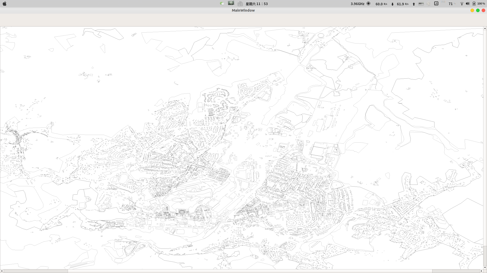
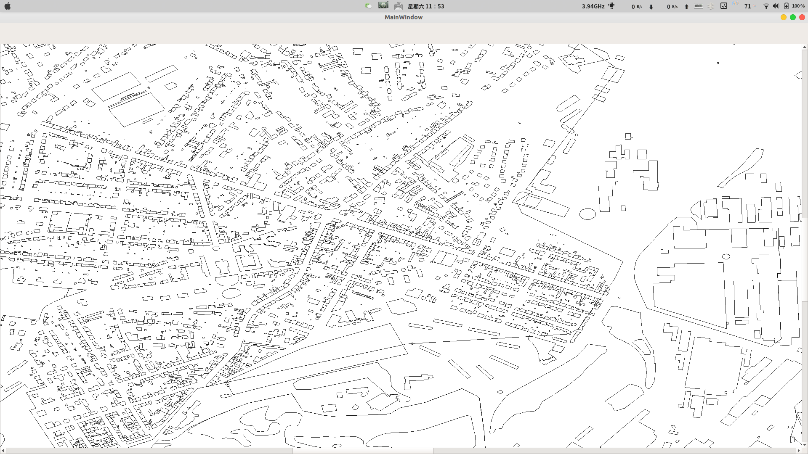

# Report for development, date:16/11/2019

## So far I have done

### DataBase

- [x] Basic understanding for Libosmium
- [x] Using Libosmium to construct our own database, which is easier to use.
- [x] Drafted a brief user guide for the database

### Rendering

- [x] Decided to use **QGraphicsView** as the basic class for the rendering
- [x] Understand the basic API of **QGraphicsView**
- [x] Implement a basic demo for rendering( only display the multipolygon in the osm file we found)
- [x] Implement the basic user interaction with the **QGraphicsView**, inlcuding drag and zoom

## What I am doing for 17/11 - 23/11

### DataBase

- [x] Update features for rendering
  - [x] Extract and catagorized the multipolygon into different types
  - [x] Extract and catagorized the path into different types
  
- [ ] help update the database for routing if needed

### Rendering

Displaying:

- [x] Construct the **QGraphicItem** for differet types
- [x] Specify the rendering style for different types of **QGraphicItem**

## What I am going to do for 23/11 - 30/11

### DataBase

- [x] Implement the mercator projection for better display

### Rendering

Displaying:

- [ ] Drawing the path we get from **Belal**
- [ ] ~~Displaying names for independent point, marking the name of the places.~~

Interaction:

- [ ] Item selection when the user click on the item.
  - the entry is implemented
- [ ] right click menu | Demo is implemented
  - [ ] place searching
    - [ ] By type
    - [ ] By name
  - [ ] place selecting for routing
- [ ] `pin-point` object for place highlight

## Try to release the Alpha before Dec
