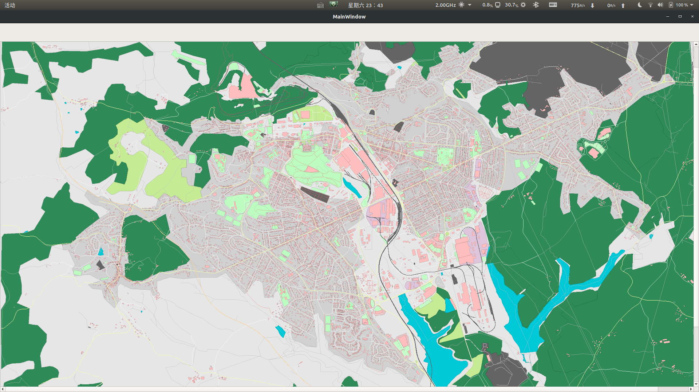
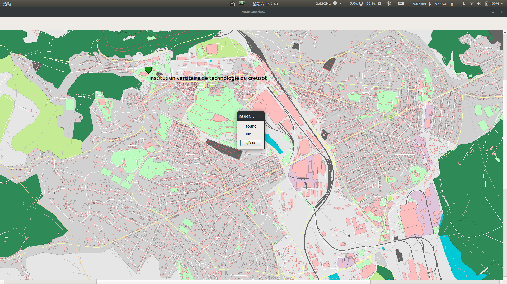
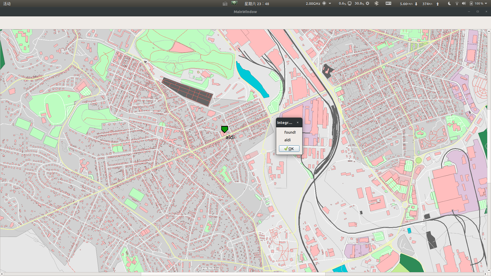
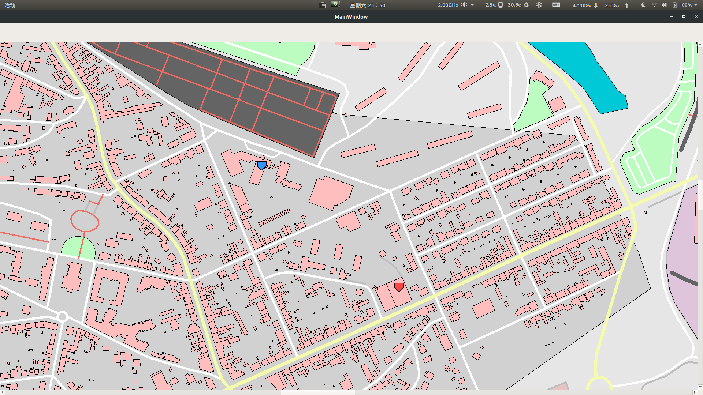

# Report for development, date:16/11/2019

## So far I have done

### DataBase

- [x] Basic understanding for Libosmium
- [x] Using Libosmium to construct our own database, which is easier to use.
- [x] Drafted a brief user guide for the database

### Rendering

- [x] Decided to use **QGraphicsView** as the basic class for the rendering
- [x] Understand the basic API of **QGraphicsView**
- [x] Implement a basic demo for rendering( only display the multipolygon in the osm file we found)
- [x] Implement the basic user interaction with the **QGraphicsView**, inlcuding drag and zoom

## What I did between 17/11 - 23/11

### DataBase

- [x] Update features for rendering
  - [x] Extract and catagorized the multipolygon into different types
  - [x] Extract and catagorized the path into different types
  
- [x] help update the database for routing if needed

### Rendering

Displaying:

- [x] Construct the **QGraphicItem** for differet types
- [x] Specify the rendering style for different types of **QGraphicItem**

## What I did between 23/11 - 30/11

### DataBase

- [x] Implement the mercator projection for better display

### Rendering

Displaying:

- [x] Drawing the path we get from **Belal**
- [ ] ~~Displaying names for independent point, marking the name of the places.~~

Interaction:

- [x] Item selection when the user click on the item.
  - the entry is implemented
- [x] right click menu | Demo is implemented
  - [x] place searching
    - [ ] By type
      - [ ] have a small little bug to be fix
    - [x] By name
  - [x] place selecting for routing
- [x] `pin-point` object for place highlight

## Try to release the Alpha before Dec

a slightly delay for release.

## Todo

after fixing the following bugs, my part will be ready to release. Ordered by priority

- [ ] fix a crash when searching place by type;
- [ ] help fix belal's code for routing;
- [ ] avoid choosing the same source and destination place for routing(not necessary, because belal's routing code doesn't support routing for random building)

some more features if we have time, ordered by priority

- [ ] put all the nodes and ways with a name to the searching catalog(or just search through all the data)

## a few more snap shot before release

